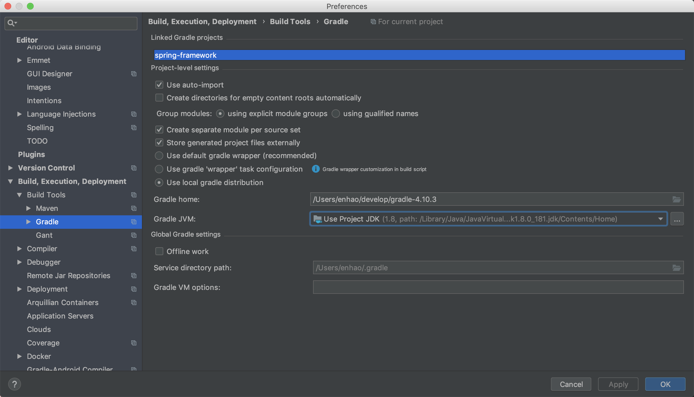

## 开发环境

- IntelliJ IDEA 2018.2
- JDK 1.8.0_181
- Gradle 4.10.3

- macOS Mojave 10.14.3

fork 的项目地址：[https://github.com/liangenhao/spring-framework](https://github.com/liangenhao/spring-framework)

development version：5.2.0.BUILD-SNAPSHOT

## 遇到的问题

### gradle build 报错

按照官方提供的文档 [《import-into-idea》](https://github.com/spring-projects/spring-framework/blob/master/import-into-idea.md)，导入项目后，IDEA 自动进行 Build，build 一段时间后，报错：

```java
java.lang.AbstractMethodError: org.jetbrains.plugins.gradle.tooling.util.ModuleComponentIdentifierImpl.getModuleIdentifier()Lorg/gradle/api/artifacts/ModuleIdentifier;
```

由于 IDEA 默认使用最新的 gradle，而 IntelliJ IDEA 2018.2 和 现在最新版本的 gradle 不兼容，所以，重新下载较低版本的 gradle 4.10.3 ，并配置 IntelIiJ IDEA -> Preferences -> Build,Execution, Deployment -> Build Tools -> Gradle，勾选`Use local gradle distribution`，并指定自己下载的`Gradle home`。



### cglib 和 obienesis 的编译错误（并未遇到）

根据《Spring源码深度解析 第2版》书中描述，Spring 把 最新的 cglib 和 objenesis 给重新打包了，源码中并没有提供，会出现编译报错。但我实际导入过程中，在gradle build 之后，这两个包已经被下载了，所以并没有遇到这种情况。

> 猜测应该最新的Spring 在 gradle 配置文件里配置了吧。

### AspectJ 编译问题

同样是《Spring源码深度解析 第2版》书中的内容，具体<u>关于 AspectJ 内容可以查看《Spring源码深度解析 第2版》12页</u>

官方提供的文档 [《import-into-idea》](https://github.com/spring-projects/spring-framework/blob/master/import-into-idea.md)中指出，可以移除掉`spring-aspect`项目。

## 预编译 spring-oxm 项目

在 Terminal 执行：

```shell
./gradlew :spring-oxm:compileTestJava
```

当看到 `BUILD SUCCESSFUL` ，说明编译成功。


## 参考资料

- 芋道源码 精尽 Spring 源码分析
- 《Spring源码深度解析 第2版》

