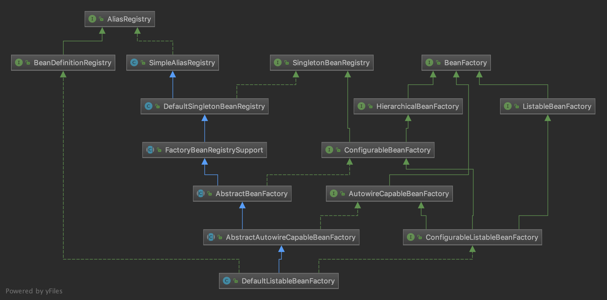
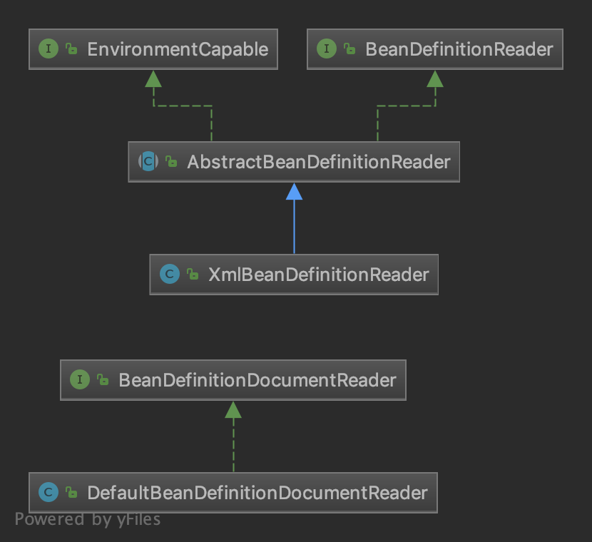

## 核心类

> 内容来自于《Spring源码深度解析 第2版》P23。

### DefaultListableBeanFactory

**`DefaultListableBeanFactory` 是整个bean加载的核心部分，是 Spring 注册及加载 bean 的默认实现。**



> 类图中各个类的作用，可看《Spring源码深度解析 第2版》P24-25。

`DefaultListableBeanFactory`有唯一的子类`XmlBeanFactory`，使用了自定义的XML读取器`XmlBeanDefinitionReader`，实现了个性化的`BeanDefinitionReader`读取。

不过从 Spring 3.1 开始，`XmlBeanFactory`被标记为过时，推荐使用`DefaultListableBeanFactory`和`XmlBeanDefinitionReader`共同完成。

### XmlBeanDefinitionReader

Xml 配置文件读取是 Spring 中重要的功能，配置读取相关类图如下：



## IOC 容器执行步骤

使用`DefaultListableBeanFactory`和`XmlBeanDefinitionReader`使用IOC容器代码如下：

```java
ClassPathResource resource = new ClassPathResource("bean.xml"); // 1
DefaultListableBeanFactory factory = new DefaultListableBeanFactory(); // 2
XmlBeanDefinitionReader reader = new XmlBeanDefinitionReader(factory); // 3
reader.loadBeanDefinitions(resource); // 4
```

> 1. 获取资源。
> 2. 获取 `BeanFactory`。
> 3. 根据新建的 `BeanFactory` 创建一个 `BeanDefinitionReader` 对象，该 Reader 对象为资源的**解析器**。
> 4. 装载资源。

分为三个步骤：

1. 资源定位，通常用外部资源（配置文件）来描述bean对象，因此是首先定位到外部这个资源（Resource）。

   > 详见：[Spring 源码学习-IOC-资源定位](./03 Spring 源码学习-IOC-资源定位.md)

2. 装载，就是 `BeanDefinition` 的载入。使用`BeanDefinitionReader`读取解析`Resource`资源，将bean表示成`BeanDefinition `。

   > 详见：[Spring 源码学习-IOC-资源装载](./04 Spring 源码学习-IOC-资源装载)

   - 在 IoC 容器内部维护着一个 `BeanDefinition` Map 的数据结构。
   - 在配置文件中每一个 `<bean>` 都对应着一个 `BeanDefinition` 对象。

3. 注册，TODO

   > 详见：


## 参考资料

- 芋道源码 精尽 Spring 源码分析
- 《Spring源码深度解析 第2版》