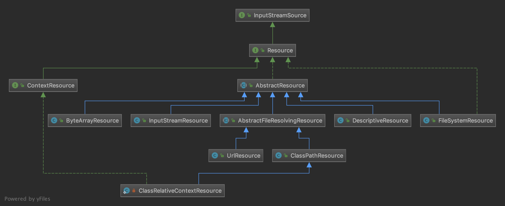

## 资源定义 - Resource

### 总览

由于 Java 中的 `URLStreamHandler` 不能满足读取不同来源的资源，所以 Spring 实现了自己的抽象结构：`Resource`接口。

`Resource`接口：提供的契约：

- 判断当前状态：exists，isReadable，isOpen，isFile
- 不同资源到URL、URI、File的转换。
- 属性：lastModifiled 属性、文件名、资源内容长度
- 错误处理信息。

> 具体代码见：`org.springframework.core.io.Resource`

`Resource`接口核心实现类类图：



- `FileSystemResource` ：对 `java.io.File` 类型资源的封装，只要是跟 File 打交道的，基本上与 `FileSystemResource` 也可以打交道。支持文件和 URL 的形式，实现 `WritableResource` 接口，且从 Spring Framework 5.0 开始，`FileSystemResource` 使用 NIO2 API进行读/写交互。
- `ByteArrayResource` ：对字节数组提供的数据的封装。如果通过 InputStream 形式访问该类型的资源，该实现会根据字节数组的数据构造一个相应的 ByteArrayInputStream。
- `InputStreamResource` ：将给定的 InputStream 作为一种资源的 Resource 的实现类。只有在没有其他特定资源实现可用时才应使用。特别是，尽可能选择ByteArrayResource或任何基于文件的资源实现。如果需要将资源描述符保存在某个地方，或者需要多次从流中读取，则不要使用InputStreamResource。
- `DescriptiveResource`：包含资源描述但不指向实际可读资源的简单资源实现。如果API期望某个资源参数，但不一定用于实际读取，则将其用作占位符。
- `AbstractFileResolvingResource`：将url解析为文件引用(如UrlResource或ClassPathResource)的资源的抽象基类。
- `UrlResource` ：对 `java.net.URL`类型资源的封装。内部委派 URL 进行具体的资源操作。
- `ClassPathResource` ：class path 类型资源的实现。使用给定的 ClassLoader 或者给定的 Class 来加载资源。

### AbstractResource

`AbstractResource` 是 `Resource` 默认抽象实现。它实现了 Resource 接口的**大部分的公共实现**。

> 具体代码见：`org.springframework.core.io.AbstractResource`

> 如果我们想要自定义 Resource，直接继承 `AbstractResource`类，覆盖相应方法即可。


## 资源加载 - ResourceLoader


### ResourceLoader

ResourceLoader，定义资源加载器，主要应用于根据给定的资源文件地址，返回对应的 Resource 。

详见`org.springframework.core.io.ResourceLoader`

### DefaultResourceLoader

是`org.springframework.core.io.ResourceLoader`的默认实现。

【无参构造】：

初始化类加载器为当前线程上下文的类加载器。

【核心方法实现】：`#getResource(String location)`，

具体解析见`org.springframework.core.io.DefaultResourceLoader#getResource`。

该方法会解析参数location，返回相应的Resource的子类对象。

【自定义ResourceLoader】：

`DefaultResourceLoader` 提供了 SPI 技术，用作自定义`ResourceLoader`。

提供了自定义资源解决策略接口`ProtocolResolver`，用户只需要实现`ProtocolResolver`接口，并通过`DefaultResourceLoader.addProtocolResolver`方法添加，就可以实现自定义`ResourceLoader`。具体可参考源码中的解释。

【示例】：

```java
ResourceLoader resourceLoader = new DefaultResourceLoader();

Resource fileResource1 = resourceLoader.getResource("D:/Users/chenming673/Documents/spark.txt");
System.out.println("fileResource1 is FileSystemResource:" + (fileResource1 instanceof FileSystemResource));

Resource fileResource2 = resourceLoader.getResource("/Users/chenming673/Documents/spark.txt");
System.out.println("fileResource2 is ClassPathResource:" + (fileResource2 instanceof ClassPathResource));

Resource urlResource1 = resourceLoader.getResource("file:/Users/chenming673/Documents/spark.txt");
System.out.println("urlResource1 is UrlResource:" + (urlResource1 instanceof UrlResource));

Resource urlResource2 = resourceLoader.getResource("http://www.baidu.com");
System.out.println("urlResource1 is urlResource:" + (urlResource2 instanceof  UrlResource));
```

> fileResource1 is FileSystemResource:false
> fileResource2 is ClassPathResource:true
> urlResource1 is UrlResource:true
> urlResource1 is urlResource:true

#### FileSystemResourceLoader

`FileSystemResourceLoader` 。它继承 `DefaultResourceLoader` ，且覆写了 `#getResourceByPath(String)` 方法，使之从文件系统加载资源并以 `FileSystemResource` 类型返回。

【示例】：更改上一个示例的第一个测试。

```java
ResourceLoader resourceLoader = new FileSystemResourceLoader();

Resource fileResource1 = resourceLoader.getResource("D:/Users/chenming673/Documents/spark.txt");
System.out.println("fileResource1 is FileSystemResource:" + (fileResource1 instanceof FileSystemResource));
```

> fileResource1 is FileSystemResource:true

#### ClassRelativeResourceLoader

`org.springframework.core.io.ClassRelativeResourceLoader` ，是 DefaultResourceLoader 的另一个子类的实现。和 FileSystemResourceLoader 类似，在实现代码的结构上类似，也是覆写 `#getResourceByPath(String path)` 方法，并返回其对应的 ClassRelativeContextResource 的资源类型。

### ResourcePatternResolver

上面的实现类，每次只能根据location返回一个Resource，`ResourcePatternResolver`根据指定的资源路径匹配模式每次返回**多个** Resource 实例。

#### PathMatchingResourcePatternResolver

`org.springframework.core.io.support.PathMatchingResourcePatternResolver` ，为 ResourcePatternResolver 最常用的子类，它除了支持 ResourceLoader 和 ResourcePatternResolver 新增的 `"classpath*:"` 前缀外，**还支持 Ant 风格的路径匹配模式**（类似于 `"**/*.xml"`）。


## Resource 和 ResourceLoader 的关系

- `Resource` 有很多的实现类：`UrlResource`、`ClassPathResource` 等等。

- 如果我们直接用`Resource`来获取一个``Resource`子类对象，你首先得知道既要获取的资源什么类型的，才能new出对应的子类对象。

- `ResourceLoader`相当于策略者模式，`org.springframework.core.io.DefaultResourceLoader#getResource`方法会根据传入的路径进行分析，返回出对应的`Resource`子类对象。例如`DefaultResourceLoader#getResource`


## 参考资料

- 芋道源码 精尽 Spring 源码分析
- 《Spring源码深度解析 第2版》


