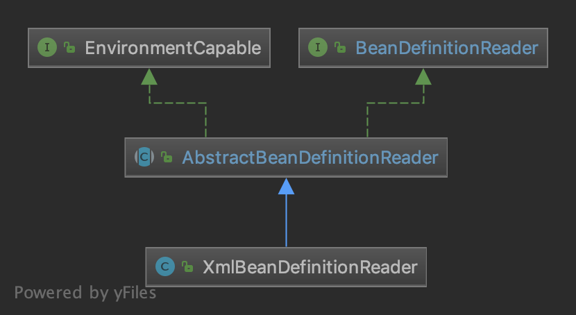

## 什么是资源装载

IOC容器使用的第二个步骤：资源定位。

在[第一步](03 Spring 源码学习-IOC-资源定位.md)中，已经获取到了资源`Resource`，第二步就是读取并解析`Resource`资源，将用户定义的Bean转换成`BeanDefinition`对象。

- 在 IoC 容器内部维护着一个 `BeanDefinition` Map 的数据结构。
- 在配置文件中每一个 `<bean>` 都对应着一个 `BeanDefinition` 对象。

## 资源装载 - BeanDefinitionReader

### BeanDefinitionReader 体系结构一览

`BeanDefinitionReader`是资源装载的顶层接口，读取并解析`Resource`资源，将用户定义的Bean转换成`BeanDefinition`对象。

核心方法：可以使用 `Resource` 或 资源路径(location) 来加载资源。

**最核心方法：`org.springframework.beans.factory.support.BeanDefinitionReader#loadBeanDefinitions(org.springframework.core.io.Resource)`**




### AbstractBeanDefinitionReader

`AbstractBeanDefinitionReader`是`BeanDefinitionReader`的默认实现。

该默认实现并没有实现，`BeanDefinitionReader#loadBeanDefinitions(Resource)`方法，而是交由子类实现，其他的方法，如`#loadBeanDefinitions(Resource...)`、`#loadBeanDefinitions(String)`、`#loadBeanDefinitions(String...)` 这些方法，最终也是调用`#loadBeanDefinitions(org.springframework.core.io.Resource)`实现的。

> `AbstractBeanDefinitionReader`具体解析见源码。

### XmlBeanDefinitionReader

`XmlBeanDefinitionReader`是`AbstractBeanDefinitionReader`的具体实现，用于xml文件的读取解析。

实际解析部分委托给了`BeanDefinitionDocumentReader`处理。

【核心方法】：`XmlBeanDefinitionReader#loadBeanDefinitions(org.springframework.core.io.Resource)`

#### loadBeanDefinitions 方法解析

会看[Spring 源码学习-IOC-总览](02 Spring 源码学习-IOC-总览.md)中的案例，代码最终调用了`reader.loadBeanDefinitions(resource);`来加载`BeanDefinition`。

##### loadBeanDefinitions

```java
// org.springframework.beans.factory.xml.XmlBeanDefinitionReader#loadBeanDefinitions(org.springframework.core.io.Resource)
@Override
public int loadBeanDefinitions(Resource resource) throws BeanDefinitionStoreException {
    // EncodedResource: 对 Resource 进行编码，保证内容读取的正确性
    return loadBeanDefinitions(new EncodedResource(resource));
}

// org.springframework.beans.factory.xml.XmlBeanDefinitionReader#loadBeanDefinitions(org.springframework.core.io.support.EncodedResource)
public int loadBeanDefinitions(EncodedResource encodedResource) throws BeanDefinitionStoreException {
    Assert.notNull(encodedResource, "EncodedResource must not be null");
    if (logger.isTraceEnabled()) {
        logger.trace("Loading XML bean definitions from " + encodedResource);
    }
    // 获取当前线程已经加载的资源（EncodedResource）
    Set<EncodedResource> currentResources = this.resourcesCurrentlyBeingLoaded.get();
    if (currentResources == null) {
        // 如果当前线程尚未加载过资源（EncodedResource）
        currentResources = new HashSet<>(4);
        this.resourcesCurrentlyBeingLoaded.set(currentResources);
    }
    // 将传递进来的资源（EncodedResource）添加进集合，如果该资源已存在，抛出异常
    if (!currentResources.add(encodedResource)) {
        // 避免一个 EncodedResource 在加载时，还没加载完成，又加载自身，从而导致死循环。
        // 也因此，在 该方法最后处，当一个 EncodedResource 加载完成后，需要从缓存中剔除。
        throw new BeanDefinitionStoreException(
            "Detected cyclic loading of " + encodedResource + " - check your import definitions!");
    }
    try {
        // 从封装好的encodedResource中获取Resource，并从Resource中获取InputStream
        // 感觉这里可以直接写成encodedResource.getInputStream();
        InputStream inputStream = encodedResource.getResource().getInputStream();
        try {
            // inputStream 封装成 InputSource，该类来自于 org.xml.sax.InputSource
            InputSource inputSource = new InputSource(inputStream);
            if (encodedResource.getEncoding() != null) {
                // 设置编码
                inputSource.setEncoding(encodedResource.getEncoding());
            }
            // 核心逻辑，真正开始加载BeanDefinition
            return doLoadBeanDefinitions(inputSource, encodedResource.getResource());
        }
        finally {
            inputStream.close();
        }
    }
    catch (IOException ex) {
        throw new BeanDefinitionStoreException(
            "IOException parsing XML document from " + encodedResource.getResource(), ex);
    }
    finally {
        // 从缓存中删除该资源
        currentResources.remove(encodedResource);
        if (currentResources.isEmpty()) {
            this.resourcesCurrentlyBeingLoaded.remove();
        }
    }
}
```

##### doLoadBeanDefinitions

核心逻辑，真正开始加载`BeanDefinition`。

```java
// org.springframework.beans.factory.xml.XmlBeanDefinitionReader#doLoadBeanDefinitions
protected int doLoadBeanDefinitions(InputSource inputSource, Resource resource)
      throws BeanDefinitionStoreException {

   try {
      // 加载xml文件，得到Document对象
      Document doc = doLoadDocument(inputSource, resource);
      // 根据Document对象注册Bean信息
      int count = registerBeanDefinitions(doc, resource);
      if (logger.isDebugEnabled()) {
         logger.debug("Loaded " + count + " bean definitions from " + resource);
      }
      return count;
   }
   catch (BeanDefinitionStoreException ex) {
      throw ex;
   }
   catch (SAXParseException ex) {
      throw new XmlBeanDefinitionStoreException(resource.getDescription(),
            "Line " + ex.getLineNumber() + " in XML document from " + resource + " is invalid", ex);
   }
   catch (SAXException ex) {
      throw new XmlBeanDefinitionStoreException(resource.getDescription(),
            "XML document from " + resource + " is invalid", ex);
   }
   catch (ParserConfigurationException ex) {
      throw new BeanDefinitionStoreException(resource.getDescription(),
            "Parser configuration exception parsing XML from " + resource, ex);
   }
   catch (IOException ex) {
      throw new BeanDefinitionStoreException(resource.getDescription(),
            "IOException parsing XML document from " + resource, ex);
   }
   catch (Throwable ex) {
      throw new BeanDefinitionStoreException(resource.getDescription(),
            "Unexpected exception parsing XML document from " + resource, ex);
   }
}

// org.springframework.beans.factory.xml.XmlBeanDefinitionReader#doLoadDocument
protected Document doLoadDocument(InputSource inputSource, Resource resource) throws Exception {
    // 1. getValidationModeForResource：获取对xml文件的验证模式：DTD、XSD
	// 2. 获取xml Document对象
    return this.documentLoader.loadDocument(inputSource, getEntityResolver(), this.errorHandler,
                                            getValidationModeForResource(resource), isNamespaceAware());
}

// org.springframework.beans.factory.xml.XmlBeanDefinitionReader#registerBeanDefinitions
public int registerBeanDefinitions(Document doc, Resource resource) throws BeanDefinitionStoreException {
    // 委托给BeanDefinitionDocumentReader进行注册
    BeanDefinitionDocumentReader documentReader = createBeanDefinitionDocumentReader();
    int countBefore = getRegistry().getBeanDefinitionCount();
    documentReader.registerBeanDefinitions(doc, createReaderContext(resource));
    return getRegistry().getBeanDefinitionCount() - countBefore;
}
```

> 加载`BeanDefinition`主要分为两步：
>
> 1. 加载xml文件，得到`Document`对象。
> 2. 根据`Document`对象，注册Bean信息。

###### 第一步：doLoadDocument - 获取 Document 对象

<a href="./04.1 Spring 源码学习-IOC-资源装载-获取XML验证模式.md">test</a>

1. xml的模式验证：详见 [Spring 源码学习-IOC-资源装载-获取XML验证模式](./04.1 Spring 源码学习-IOC-资源装载-获取XML验证模式.md)
2. 获取Document对象：详见[04.2 Spring 源码学习-IOC-资源装载-获取Document对象](./04.2 Spring 源码学习-IOC-资源装载-获取Document对象.md)

###### 第二步：registerBeanDefinitions - 注册 BeanDefinition

1. 注册 BeanDefinition：详见[04.3 Spring 源码学习-IOC-资源装载-注册BeanDefinition](./04.3 Spring 源码学习-IOC-资源装载-注册BeanDefinition.md)


## 参考资料

- 芋道源码 精尽 Spring 源码分析
- 《Spring源码深度解析 第2版》