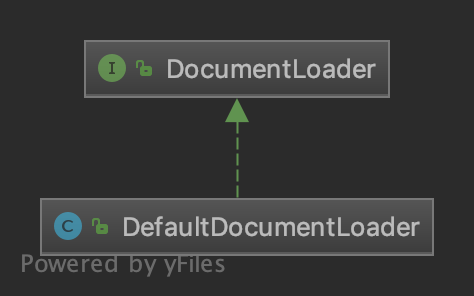
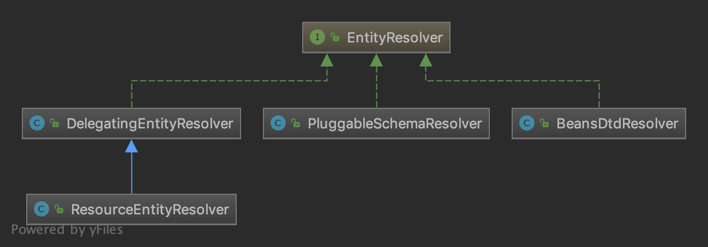
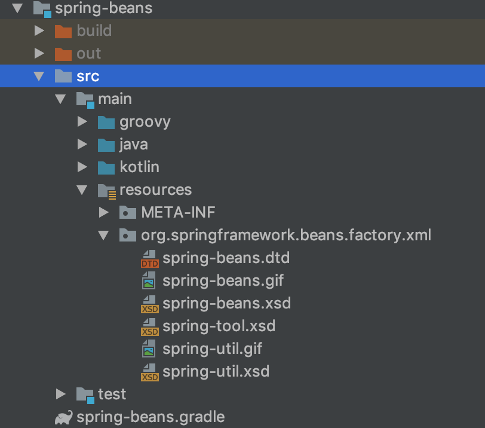

> [资源装载](04-Spring源码学习-IOC-资源装载.md#第一步：doLoadDocument-获取Document对象)中的第一步：在获取XML的验证模式之后，获取`Document`对象。
>
> 对应《Spring源码深度解析 第2版》P37 2.7 获取Document对象。

回看[资源装载](04-Spring源码学习-IOC-资源装载.md)中，装载资源分为两步：

1. 加载xml文件，得到`Document`对象。
2. 根据`Document`对象，注册Bean信息。

在 [获取XML验证模式](04.1-Spring源码学习-IOC-资源装载-获取XML验证模式.md)中，已经获取了XML的验证模式，然后就是获取`Document`对象了。

**同样`XmlBeanDefinitionReader`并没有自己去获取`Document`对象，而是委托给了`DocumentLoader`处理。**


## DocumentLoader



`DocumentLoader`是用于加载XML文档的策略接口，它有唯一的一个方法`loadDocument`：

```java
/**
	 * 通过 {@link InputSource} 对象来加载文档{@link Document}
	 * 注意：InputSource 来源于 org.xml.sax 包，Document 来源于 org.w3c.dom 包。他们都是w3c标准，不是Spring的类。
	 *
	 * @param inputSource 加载 document 的源
	 * @param entityResolver  解析文件的解析器。
	 * @param errorHandler 处理加载 Document 对象的过程的错误。
	 * @param validationMode  验证模式 DTD 或者 XSD
	 * @param namespaceAware  命名空间支持。如果要提供对 XML 名称空间的支持，则需要值为 true
	 * @return the loaded {@link Document document}
	 * @throws Exception if an error occurs
	 */
	Document loadDocument(
			InputSource inputSource, EntityResolver entityResolver,
			ErrorHandler errorHandler, int validationMode, boolean namespaceAware)
			throws Exception;
```

### DefaultDocumentLoader

`DefaultDocumentLoader`是`DocumentLoader`的默认实现类。也是目前唯一实现类。

它**默认使用的是标准的jaxp（Java API for XMLProcessing）配置的XML解析器加载文档。**

> 这里都xml标准，没什么特殊的地方。

步骤如下：

1. 首先创建 `DocumentBuilderFactory`对象。
2. 再通过`DocumentBuilderFactory`创建`DocumentBuilder`对象。
3. **进而通过`DocumentBuilder`解析`InputSource`来返回`Document`对象。**

> 这里的`DocumentBuilderFactory`和`DocumentBuilder`来自于`javax.xml.parsers`，`InputSource`来自于`org.xml.sax`，`Document`来自于`org.w3c.dom`。

```java
// org.springframework.beans.factory.xml.DefaultDocumentLoader#loadDocument
public Document loadDocument(InputSource inputSource, EntityResolver entityResolver,
      ErrorHandler errorHandler, int validationMode, boolean namespaceAware) throws Exception {
   // 1. 获取 DocumentBuilderFactory 对象
   DocumentBuilderFactory factory = createDocumentBuilderFactory(validationMode, namespaceAware);
   if (logger.isTraceEnabled()) {
      logger.trace("Using JAXP provider [" + factory.getClass().getName() + "]");
   }
   // 2. 使用 DocumentBuilderFactory 创建 DocumentBuilder 对象
   DocumentBuilder builder = createDocumentBuilder(factory, entityResolver, errorHandler);
   // 3. 通过 DocumentBuilder 来解析
   return builder.parse(inputSource);
}
// 创建DocumentBuilderFactory对象
private static final String SCHEMA_LANGUAGE_ATTRIBUTE = "http://java.sun.com/xml/jaxp/properties/schemaLanguage";
private static final String XSD_SCHEMA_LANGUAGE = "http://www.w3.org/2001/XMLSchema";
protected DocumentBuilderFactory createDocumentBuilderFactory(int validationMode, boolean namespaceAware)
    throws ParserConfigurationException {
    // 创建 DocumentBuilderFactory 对象
    DocumentBuilderFactory factory = DocumentBuilderFactory.newInstance();
    // 设置命名空间支持
    factory.setNamespaceAware(namespaceAware);

    if (validationMode != XmlValidationModeDetector.VALIDATION_NONE) {
        // 开启校验
        factory.setValidating(true);

        if (validationMode == XmlValidationModeDetector.VALIDATION_XSD) {
            // 如果是XSD校验模式，设置命名空间支持
            // Enforce namespace aware for XSD...
            factory.setNamespaceAware(true);
            try {
                // 设置SCHEMA_LANGUAGE_ATTRIBUTE
                factory.setAttribute(SCHEMA_LANGUAGE_ATTRIBUTE, XSD_SCHEMA_LANGUAGE);
            }
            catch (IllegalArgumentException ex) {
                ParserConfigurationException pcex = new ParserConfigurationException(
                    "Unable to validate using XSD: Your JAXP provider [" + factory +
                    "] does not support XML Schema. Are you running on Java 1.4 with Apache Crimson? " +
                    "Upgrade to Apache Xerces (or Java 1.5) for full XSD support.");
                pcex.initCause(ex);
                throw pcex;
            }
        }
    }

    return factory;
}

protected DocumentBuilder createDocumentBuilder(DocumentBuilderFactory factory,
                                                @Nullable EntityResolver entityResolver, 
                                                @Nullable ErrorHandler errorHandler)
    throws ParserConfigurationException {
    // 通过工厂创建 DocumentBuilder 对象
    DocumentBuilder docBuilder = factory.newDocumentBuilder();
    if (entityResolver != null) {
        // 设置 EntityResolver
        docBuilder.setEntityResolver(entityResolver);
    }
    if (errorHandler != null) {
        // 设置错误处理器
        docBuilder.setErrorHandler(errorHandler);
    }
    return docBuilder;
}
```


## 扩展：EntityResolver

通过分析上面的源码，发现使用了一个接口：`EntityResolver`。该接口来自于`org.xml.sax`。

回看[资源装载](04-Spring源码学习-IOC-资源装载.md)，`EntityResolver`对象是通过`XmlBeanDefinitionReader#getEntityResolver`方法获取的。

```java
protected EntityResolver getEntityResolver() {
   // 如果没有设置过entityResolver，使用默认的entityResolver
   if (this.entityResolver == null) {
      // Determine default EntityResolver to use.
      ResourceLoader resourceLoader = getResourceLoader();
      // ResourceLoader不为null，创建一个ResourceEntityResolver
      if (resourceLoader != null) {
         this.entityResolver = new ResourceEntityResolver(resourceLoader);
      }
      // ResourceLoader为null，创建一个DelegatingEntityResolver
      else {
         this.entityResolver = new DelegatingEntityResolver(getBeanClassLoader());
      }
   }
   // 如果设置过entityResolver，直接返回，否则使用默认的entityResolver
   return this.entityResolver;
}
```

### EntityResolver 的作用

> 内容来自于《Spring源码深度解析 第2版》P38。

解析一个 XML, SAX 首先读取该 XML 文档上的声明，根据声明去寻找相应的 DTD定义，以便对文档进行一个验证。 默认的寻找规则，即通过网络(实现上就是声明的 DTD 的 URI 地址)来下载相应的 DTD 声明，并进行认证。下载的过程是一个漫长的过程，而且当网络中断或不可用时，这里会报错，就是因为相应的 DTD声明没有被找到的原因 。

**`EntityResolver` 的作用是项目本身就可以提供一个如何寻找 DTD 声明的方法，即由程序来实现寻找 DTD 声明的过程，比如我们将 DTD 文件放到项目中某处 ，在实现时直接将此文档读取并返回给 SAX 即可。 这样就避免了通过网络来寻找相应的声明。**

`EntityResolver`接口唯一方法声明如下：

```java
InputSource resolveEntity (String publicId,String systemId);
```

它接受两个参数`publicId`和`systemId`。

【解析DTD的配置文件】：

```xml-dtd
<?xml version="1.0" encoding="UTF-8" ?>
<!DOCTYPE beans PUBLIC "-//SPRING//DTD BEAN 2.0//EN" "https://www.springframework.org/dtd/spring-beans-2.0.dtd">
<beans>
</beans>
```

- publicId：-//Spring//DTD BEAN 2.0//EN
- systemId：http://www.Springframework.org/dtd/Spring-beans-2.0.dtd

【解析XSD的配置文件】：

```xml
<?xml version="1.0" encoding="UTF-8"?>
<beans xmlns="http://www.springframework.org/schema/beans"
	xmlns:xsi="http://www.w3.org/2001/XMLSchema-instance"
	xsi:schemaLocation="http://www.springframework.org/schema/beans https://www.springframework.org/schema/beans/spring-beans.xsd">

</beans>
```

- publicId：null
- systemId：https://www.springframework.org/schema/beans/spring-beans.xsd

验证文件的默认的加载方式是通过 URL 进行网络下载获取，这样会造成延迟，用户体验不好，**一般的做法都是将验证文件放置在自己的工程中。** 通过程序去读取。


### EntityResolver 具体实现 - 4个子类

`getEntityResolver`中涉及到了四个`EntityResolver`子类。相关类图如下：



#### BeansDtdResolver

用于从 classpath 或者 jar 文件中加载 DTD 文件的`EntityResolver`实现类。

```java
// org.springframework.beans.factory.xml.BeansDtdResolver#resolveEntity
public InputSource resolveEntity(@Nullable String publicId, @Nullable String systemId) throws IOException {
   if (logger.isTraceEnabled()) {
      logger.trace("Trying to resolve XML entity with public ID [" + publicId +
            "] and system ID [" + systemId + "]");
   }
   // systemId 以 '.dtd' 结尾
   if (systemId != null && systemId.endsWith(DTD_EXTENSION)) {
      int lastPathSeparator = systemId.lastIndexOf('/');
      // 获取到DTD文件名称的索引值
      int dtdNameStart = systemId.indexOf(DTD_NAME, lastPathSeparator);
      // 存在
      if (dtdNameStart != -1) {
         // 拼接文件名: spring-beans.dtd
         String dtdFile = DTD_NAME + DTD_EXTENSION;
         if (logger.isTraceEnabled()) {
            logger.trace("Trying to locate [" + dtdFile + "] in Spring jar on classpath");
         }
         try {
            // 通过 ClassPathResource 在当前 classpath 下加载
            Resource resource = new ClassPathResource(dtdFile, getClass());
            // 将加载的资源包转成InputSource，并返回
            InputSource source = new InputSource(resource.getInputStream());
            source.setPublicId(publicId);
            source.setSystemId(systemId);
            if (logger.isTraceEnabled()) {
               logger.trace("Found beans DTD [" + systemId + "] in classpath: " + dtdFile);
            }
            return source;
         }
         catch (FileNotFoundException ex) {
            if (logger.isDebugEnabled()) {
               logger.debug("Could not resolve beans DTD [" + systemId + "]: not found in classpath", ex);
            }
         }
      }
   }

   // Fall back to the parser's default behavior.
   return null;
}
```

从当前的 classpath 路径下加载`spring-beans.dtd`文件。



#### PluggableSchemaResolver

`EntityResolver`实现类，默认查找`META-INF/spring.schemas`属性文件，该属性文件每一行的格式为：`systemId = schema-location`，部分内容如下：

```properties
http\://www.springframework.org/schema/beans/spring-beans-2.0.xsd=org/springframework/beans/factory/xml/spring-beans.xsd
http\://www.springframework.org/schema/beans/spring-beans-2.5.xsd=org/springframework/beans/factory/xml/spring-beans.xsd
http\://www.springframework.org/schema/beans/spring-beans-3.0.xsd=org/springframework/beans/factory/xml/spring-beans.xsd
http\://www.springframework.org/schema/beans/spring-beans-3.1.xsd=org/springframework/beans/factory/xml/spring-beans.xsd
http\://www.springframework.org/schema/beans/spring-beans-3.2.xsd=org/springframework/beans/factory/xml/spring-beans.xsd
http\://www.springframework.org/schema/beans/spring-beans-4.0.xsd=org/springframework/beans/factory/xml/spring-beans.xsd
http\://www.springframework.org/schema/beans/spring-beans-4.1.xsd=org/springframework/beans/factory/xml/spring-beans.xsd
http\://www.springframework.org/schema/beans/spring-beans-4.2.xsd=org/springframework/beans/factory/xml/spring-beans.xsd
http\://www.springframework.org/schema/beans/spring-beans-4.3.xsd=org/springframework/beans/factory/xml/spring-beans.xsd
http\://www.springframework.org/schema/beans/spring-beans.xsd=org/springframework/beans/factory/xml/spring-beans.xsd
...
```

其中，schema-location 是类路径下的模式文件。

```java
public static final String DEFAULT_SCHEMA_MAPPINGS_LOCATION = "META-INF/spring.schemas";

public InputSource resolveEntity(@Nullable String publicId, @Nullable String systemId) throws IOException {
   if (logger.isTraceEnabled()) {
      logger.trace("Trying to resolve XML entity with public id [" + publicId +
            "] and system id [" + systemId + "]");
   }
   // XSD模式，publicId == null，这里只需要判断systemId
   if (systemId != null) {
      // 读取schema映射属性文件，默认的是META-INF/spring.schemas
      // 找到systemId对应的resourceLocation
      String resourceLocation = getSchemaMappings().get(systemId);
      // 如果resourceLocation没找到，并且systemId以https:开头，将 https: 换成 http: 重新找一遍
      if (resourceLocation == null && systemId.startsWith("https:")) {
         // Retrieve canonical http schema mapping even for https declaration
         resourceLocation = getSchemaMappings().get("http:" + systemId.substring(6));
      }
      // 找到了resourceLocation
      // 和 BeansDtdResolver 一样，从classpath下加载文件
      if (resourceLocation != null) {
         Resource resource = new ClassPathResource(resourceLocation, this.classLoader);
         try {
            InputSource source = new InputSource(resource.getInputStream());
            source.setPublicId(publicId);
            source.setSystemId(systemId);
            if (logger.isTraceEnabled()) {
               logger.trace("Found XML schema [" + systemId + "] in classpath: " + resourceLocation);
            }
            return source;
         }
         catch (FileNotFoundException ex) {
            if (logger.isDebugEnabled()) {
               logger.debug("Could not find XML schema [" + systemId + "]: " + resource, ex);
            }
         }
      }
   }

   // Fall back to the parser's default behavior.
   return null;
}
```

#### DelegatingEntityResolver

`EntityResolver`实现类，该类不会自己做处理，而是会委托给`BeansDtdResolver`或`PluggableSchemaResolver`处理：

```java
public static final String DTD_SUFFIX = ".dtd";
public static final String XSD_SUFFIX = ".xsd";

public InputSource resolveEntity(@Nullable String publicId, @Nullable String systemId)
      throws SAXException, IOException {

   if (systemId != null) {
      // 如果 systemId 以 .dtd 结尾，使用dtdResolver，默认为 BeansDtdResolver
      if (systemId.endsWith(DTD_SUFFIX)) {
         return this.dtdResolver.resolveEntity(publicId, systemId);
      }
      // 如果 systemId 以 .xsd 结尾，使用schemaResolver，默认为 PluggableSchemaResolver
      else if (systemId.endsWith(XSD_SUFFIX)) {
         return this.schemaResolver.resolveEntity(publicId, systemId);
      }
   }

   // Fall back to the parser's default behavior.
   return null;
}
```

#### ResourceEntityResolver

继承`DelegatingEntityResolver`类，是对`DelegatingEntityResolver`扩展，当使用`DelegatingEntityResolver`解析失败时，通过`ResourceLoader`来解析实体的引用。

```java
public InputSource resolveEntity(@Nullable String publicId, @Nullable String systemId)
      throws SAXException, IOException {
   // 调用 DelegatingEntityResolver#resolveEntity 方法
   InputSource source = super.resolveEntity(publicId, systemId);
   // DelegatingEntityResolver#resolveEntity 解析失败
   // 使用resourceLoader解析
   if (source == null && systemId != null) {
      String resourcePath = null;
      try {
         // 使用 utf-8 解码 systemId
         String decodedSystemId = URLDecoder.decode(systemId, "UTF-8");
         // 将解码后的systemId，转成URL字符串
         String givenUrl = new URL(decodedSystemId).toString();
         // 解析文件资源的相对路径（相对于系统根路径）
         String systemRootUrl = new File("").toURI().toURL().toString();
         // Try relative to resource base if currently in system root.
         // 如果资源路径是当前系统根路径下的资源，则截取资源路径
         if (givenUrl.startsWith(systemRootUrl)) {
            resourcePath = givenUrl.substring(systemRootUrl.length());
         }
      }
      catch (Exception ex) {
         // Typically a MalformedURLException or AccessControlException.
         if (logger.isDebugEnabled()) {
            logger.debug("Could not resolve XML entity [" + systemId + "] against system root URL", ex);
         }
         // No URL (or no resolvable URL) -> try relative to resource base.
         resourcePath = systemId;
      }
      if (resourcePath != null) {
         if (logger.isTraceEnabled()) {
            logger.trace("Trying to locate XML entity [" + systemId + "] as resource [" + resourcePath + "]");
         }
         // 通过resourceLoader获取资源
         Resource resource = this.resourceLoader.getResource(resourcePath);
         // 将InputStream封装成InputSource
         source = new InputSource(resource.getInputStream());
         source.setPublicId(publicId);
         source.setSystemId(systemId);
         if (logger.isDebugEnabled()) {
            logger.debug("Found XML entity [" + systemId + "]: " + resource);
         }
      }
      // resourcePath == null，并且 systemId以.dtd结尾或者.xsd结尾
      //        resourcePath == null，表示resourcePath不是当前系统根路径下的资源
      else if (systemId.endsWith(DTD_SUFFIX) || systemId.endsWith(XSD_SUFFIX)) {
         // External dtd/xsd lookup via https even for canonical http declaration
         String url = systemId;
         // 如果 systemId 以 http:开头，换成 https:
         if (url.startsWith("http:")) {
            url = "https:" + url.substring(5);
         }
         try {
            // 通过 URL获取资源流，最后封装成InputSource
            source = new InputSource(new URL(url).openStream());
            source.setPublicId(publicId);
            source.setSystemId(systemId);
         }
         catch (IOException ex) {
            if (logger.isDebugEnabled()) {
               logger.debug("Could not resolve XML entity [" + systemId + "] through URL [" + url + "]", ex);
            }
            // Fall back to the parser's default behavior.
            source = null;
         }
      }
   }

   return source;
}
```

## 参考资料

- 芋道源码 精尽 Spring 源码分析
- 《Spring源码深度解析 第2版》