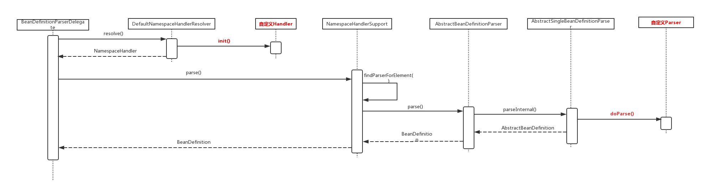

> 对应《Spring源码深度解析 第2版》P77 第四章 自定义标签的解析。

回看 [注册BeanDefinition](04.3-Spring源码学习-IOC-资源装载-注册BeanDefinition.md) ，`XmlBeanDefinitionReader`委托给`BeanDefinitionDocumentReader`进行解析：

```java
// org.springframework.beans.factory.xml.DefaultBeanDefinitionDocumentReader#parseBeanDefinitions
protected void parseBeanDefinitions(Element root, BeanDefinitionParserDelegate delegate) {
   // // 默认命名空间：命名空间为空或者是http://www.springframework.org/schema/beans
   if (delegate.isDefaultNamespace(root)) {
      // 根节点的命名空间是默认的命名空间
      // 获取根节点下的子节点
      NodeList nl = root.getChildNodes();
      // 遍历
      for (int i = 0; i < nl.getLength(); i++) {
         Node node = nl.item(i);
         if (node instanceof Element) {
            Element ele = (Element) node;
            if (delegate.isDefaultNamespace(ele)) {
               // 如果该节点使用默认命名空间，执行默认解析
               parseDefaultElement(ele, delegate);
            }
            else {
               // 如果该节点非默认命名空间，执行自定义解析
               delegate.parseCustomElement(ele);
            }
         }
      }
   }
   else {
      // 根节点的命名空间不是默认的命名空间，执行自定义解析
      delegate.parseCustomElement(root);
   }
}
```

如果元素(element)不是默认的命名空间，**则会委托给`BeanDefinitionParserDelegate`的`parseCustomElement`方法进行解析。**


## 自定义标签的使用

> 案例可参考《Spring源码深度解析 第2版》P78 自定义标签使用。

步骤：

1. 创建一个需要扩展的组件。
2. 定义一个 XSD 文件，用于描述组件内容。
3. 创建一个实现 **`org.springframework.beans.factory.xml.AbstractSingleBeanDefinitionParser` 抽象类**的类，用来解析 XSD 文件中的定义和组件定义。
4. 创建一个 Handler，继承 **`org.springframework.beans.factory.xml.NamespaceHandlerSupport`** 抽象类 ，用于将组件注册到 Spring 容器。
5. 编写 `spring.handlers` 和 `spring.schemas` 文件。

## 自定义标签的解析

```java
// org.springframework.beans.factory.xml.BeanDefinitionParserDelegate#parseCustomElement(org.w3c.dom.Element)
public BeanDefinition parseCustomElement(Element ele) {
  return parseCustomElement(ele, null);
}

public BeanDefinition parseCustomElement(Element ele, @Nullable BeanDefinition containingBd) {
  // 获取元素的命名空间
  String namespaceUri = getNamespaceURI(ele);
  // 命名空间为空，直接返回null。（为空的命名空间属于默认命名空间）
  if (namespaceUri == null) {
    return null;
  }
  // 使用 DefaultNamespaceHandlerResolver，根据命名空间获取对应的 NamespaceHandler 实现类
  // 默认加载 META-INF/spring.handlers文件，从中找出对应的 NamespaceHandler 实现类
  NamespaceHandler handler = this.readerContext.getNamespaceHandlerResolver().resolve(namespaceUri);
  // 未获取到对应命名空间的 NamespaceHandler
  if (handler == null) {
    error("Unable to locate Spring NamespaceHandler for XML schema namespace [" + namespaceUri + "]", ele);
    return null;
  }
  // 通过 NamespaceHandler 解析自定义标签。
  return handler.parse(ele, new ParserContext(this.readerContext, this, containingBd));
}
```

步骤：

1. 获取元素的命名空间。

2. 加载`META-INF/spring.handlers`文件，根据命名空间获取对应的`NamespaceHandler`。（并注册标签解析器`BeanDefinitionParser`）

   > [获取自定义标签处理器](#获取自定义标签处理器-NamespaceHandler)

3. 根据对应的`NamespaceHandler`进行解析。

   > [标签解析](#标签解析)


### 获取自定义标签处理器-NamespaceHandler

获取`NamespaceHandler`的操作，委托给了`NamespaceHandlerResolver`实现类处理。

具体的`NamespaceHandlerResolver`实现类，通过`BeanDefinitionParserDelegate`的构造方法指定。追溯源码，可以找到，**默认的实现类是`DefaultNamespaceHandlerResolver`**。

```java
// org.springframework.beans.factory.xml.DefaultNamespaceHandlerResolver#resolve
public NamespaceHandler resolve(String namespaceUri) {
  // 默认加载 META-INF/spring.handlers 里的 namespaceUri-NamespaceHandler实现类名 的键值对信息
  Map<String, Object> handlerMappings = getHandlerMappings();
  // 根据namespaceUri获取NamespaceHandler实现类名
  Object handlerOrClassName = handlerMappings.get(namespaceUri);
  // 不存在，直接返回
  if (handlerOrClassName == null) {
    return null;
  }
  // 已经初始化，直接返回
  else if (handlerOrClassName instanceof NamespaceHandler) {
    return (NamespaceHandler) handlerOrClassName;
  }
  // 需要初始化，返回的是全类名
  else {
    String className = (String) handlerOrClassName;
    try {
      // 通过反射加载子类
      Class<?> handlerClass = ClassUtils.forName(className, this.classLoader);
      // 判断 handlerClass 是不是 NamespaceHandler 的子类，如果不是抛出异常
      if (!NamespaceHandler.class.isAssignableFrom(handlerClass)) {
        throw new FatalBeanException("Class [" + className + "] for namespace [" + namespaceUri +
                                     "] does not implement the [" + NamespaceHandler.class.getName() + "] interface");
      }
      // 获取对象
      NamespaceHandler namespaceHandler = (NamespaceHandler) BeanUtils.instantiateClass(handlerClass);
      // 执行init方法，对自定义的标签解析器进行注册
      namespaceHandler.init();
      // 重新添加到缓存，value为对象，而非全类名。
      // 下次加载时可以直接返回，不用再加载一遍
      handlerMappings.put(namespaceUri, namespaceHandler);
      return namespaceHandler;
    }
    catch (ClassNotFoundException ex) {
      throw new FatalBeanException("Could not find NamespaceHandler class [" + className +
                                   "] for namespace [" + namespaceUri + "]", ex);
    }
    catch (LinkageError err) {
      throw new FatalBeanException("Unresolvable class definition for NamespaceHandler class [" +
                                   className + "] for namespace [" + namespaceUri + "]", err);
    }
  }
}

private Map<String, Object> getHandlerMappings() {
  Map<String, Object> handlerMappings = this.handlerMappings;
  // 双重锁检测，确保 handlerMappings 是单例的
  if (handlerMappings == null) {
    synchronized (this) {
      handlerMappings = this.handlerMappings;
      if (handlerMappings == null) {
        if (logger.isTraceEnabled()) {
          logger.trace("Loading NamespaceHandler mappings from [" + this.handlerMappingsLocation + "]");
        }
        try {
          // handlerMappingsLocation 默认值 META-INF/spring.handlers
          // 加载 META-INF/spring.handlers 里的内容到 Properties
          Properties mappings =
            PropertiesLoaderUtils.loadAllProperties(this.handlerMappingsLocation, this.classLoader);
          if (logger.isTraceEnabled()) {
            logger.trace("Loaded NamespaceHandler mappings: " + mappings);
          }
          handlerMappings = new ConcurrentHashMap<>(mappings.size());
          // 将从 META-INF/spring.handlers 里加载的内容合并到 handlerMappings 中
          CollectionUtils.mergePropertiesIntoMap(mappings, handlerMappings);
          this.handlerMappings = handlerMappings;
        }
        catch (IOException ex) {
          throw new IllegalStateException(
            "Unable to load NamespaceHandler mappings from location [" + this.handlerMappingsLocation + "]", ex);
        }
      }
    }
  }
  return handlerMappings;
}
```

通过`DefaultNamespaceHandlerResolver`加载`META-INF/spring.handlers`，再通过命名空间获取对应的`NamespaceHandler`实现类对象后，**调用了`init`方法，该方法主要将自定义标签解析器进行注册。**

以`org.springframework.context.config.ContextNamespaceHandler`为例：

```java
public class ContextNamespaceHandler extends NamespaceHandlerSupport {

	@Override
	public void init() {
		registerBeanDefinitionParser("property-placeholder", new PropertyPlaceholderBeanDefinitionParser());
		registerBeanDefinitionParser("property-override", new PropertyOverrideBeanDefinitionParser());
		registerBeanDefinitionParser("annotation-config", new AnnotationConfigBeanDefinitionParser());
		registerBeanDefinitionParser("component-scan", new ComponentScanBeanDefinitionParser());
		registerBeanDefinitionParser("load-time-weaver", new LoadTimeWeaverBeanDefinitionParser());
		registerBeanDefinitionParser("spring-configured", new SpringConfiguredBeanDefinitionParser());
		registerBeanDefinitionParser("mbean-export", new MBeanExportBeanDefinitionParser());
		registerBeanDefinitionParser("mbean-server", new MBeanServerBeanDefinitionParser());
	}

}

private final Map<String, BeanDefinitionParser> parsers = new HashMap<>();

// org.springframework.beans.factory.xml.NamespaceHandlerSupport#registerBeanDefinitionParser
protected final void registerBeanDefinitionParser(String elementName, BeanDefinitionParser parser) {
		this.parsers.put(elementName, parser);
	}
```

可见，`init`方法，是将自定义的`BeanDefinitionParser`进行注册，也就是缓存到集合中。

### 标签解析

成功获取`NamespaceHandler`实现类后，就是通过`NamespaceHandler`对标签进行解析。

`handler.parse(ele, new ParserContext(this.readerContext, this, containingBd))`

默认的实现是`NamespaceHandlerSupport`类：

```java
// org.springframework.beans.factory.xml.NamespaceHandlerSupport#parse
public BeanDefinition parse(Element element, ParserContext parserContext) {
  // 获取对应的自定义 BeanDefinitionParser 对象
  BeanDefinitionParser parser = findParserForElement(element, parserContext);
  // 委托 BeanDefinitionParser 对象解析
  return (parser != null ? parser.parse(element, parserContext) : null);
}
private BeanDefinitionParser findParserForElement(Element element, ParserContext parserContext) {
  // 获取 element 的 名称
  // 例如：<context:component-scan />，则 localName 就是 component-scan
  String localName = parserContext.getDelegate().getLocalName(element);
  // 之前在获取 NamespaceHandler 对象时，调用init() 方法，将 BeanDefinitionParser 实现类注册到 parsers 中
  // org.springframework.beans.factory.xml.DefaultNamespaceHandlerResolver.resolve
  // 现在获取 element 对应的 BeanDefinitionParser 对象
  BeanDefinitionParser parser = this.parsers.get(localName);
  if (parser == null) {
    parserContext.getReaderContext().fatal(
      "Cannot locate BeanDefinitionParser for element [" + localName + "]", element);
  }
  return parser;
}

```

步骤：

1. 获取对应元素(element)的`BeanDefinitionParser`对象。
2. 委托给对应的`BeanDefinitionParser`进行解析，`parse`方法，在`AbstractBeanDefinitionParser`中实现。


```java
// org.springframework.beans.factory.xml.AbstractBeanDefinitionParser#parse
public final BeanDefinition parse(Element element, ParserContext parserContext) {
  // 解析：内部解析，生成 AbstractBeanDefinition 对象。
  AbstractBeanDefinition definition = parseInternal(element, parserContext);

  // 解析完成后，将 AbstractBeanDefinition 包装成 BeanDefinitionHolder，并进行注册

  // 解析成功，并且不是嵌套的（即没有父bean）
  if (definition != null && !parserContext.isNested()) {
    try {
      // 解析id属性，
      String id = resolveId(element, definition, parserContext);
      if (!StringUtils.hasText(id)) {
        parserContext.getReaderContext().error(
          "Id is required for element '" + parserContext.getDelegate().getLocalName(element)
          + "' when used as a top-level tag", element);
      }
      // 解析 aliases 属性
      String[] aliases = null;
      if (shouldParseNameAsAliases()) {
        String name = element.getAttribute(NAME_ATTRIBUTE);
        if (StringUtils.hasLength(name)) {
          aliases = StringUtils.trimArrayElements(StringUtils.commaDelimitedListToStringArray(name));
        }
      }
      // 创建 BeanDefinitionHolder 对象
      BeanDefinitionHolder holder = new BeanDefinitionHolder(definition, id, aliases);
      // 注册 BeanDefinition
      // 这里和默认标签的注册一样
      registerBeanDefinition(holder, parserContext.getRegistry());
      // 触发事件
      if (shouldFireEvents()) {
        BeanComponentDefinition componentDefinition = new BeanComponentDefinition(holder);
        postProcessComponentDefinition(componentDefinition);
        parserContext.registerComponent(componentDefinition);
      }
    }
    catch (BeanDefinitionStoreException ex) {
      String msg = ex.getMessage();
      parserContext.getReaderContext().error((msg != null ? msg : ex.toString()), element);
      return null;
    }
  }
  return definition;
}
```

步骤：解析生成`AbstractBeanDefinition`对象 -> 将`AbstractBeanDefinition`对象封装成`BeanDefinitionHolder`对象 -> 注册。

大致逻辑和默认标签的解析一样，关键在于解析生成`AbstractBeanDefinition`对象：

```java
// org.springframework.beans.factory.xml.AbstractSingleBeanDefinitionParser#parseInternal
protected final AbstractBeanDefinition parseInternal(Element element, ParserContext parserContext) {
  // 构建 BeanDefinitionBuilder 对象
  BeanDefinitionBuilder builder = BeanDefinitionBuilder.genericBeanDefinition();
  // 获取父类元素
  String parentName = getParentName(element);
  if (parentName != null) {
    builder.getRawBeanDefinition().setParentName(parentName);
  }
  // 获取自定义标签中的 class，这个时候会去调用自定义解析中的 getBeanClass()
  Class<?> beanClass = getBeanClass(element);
  if (beanClass != null) {
    builder.getRawBeanDefinition().setBeanClass(beanClass);
  }
  else {
    // beanClass 为 null，意味着子类并没有重写 getBeanClass() 方法，则尝试去判断是否重写了 getBeanClassName()
    String beanClassName = getBeanClassName(element);
    if (beanClassName != null) {
      builder.getRawBeanDefinition().setBeanClassName(beanClassName);
    }
  }
  // 设置 source 属性
  builder.getRawBeanDefinition().setSource(parserContext.extractSource(element));
  // 设置 scope 属性
  BeanDefinition containingBd = parserContext.getContainingBeanDefinition();
  if (containingBd != null) {
    // Inner bean definition must receive same scope as containing bean.
    builder.setScope(containingBd.getScope());
  }
  // 设置 lazy-init 属性
  if (parserContext.isDefaultLazyInit()) {
    // Default-lazy-init applies to custom bean definitions as well.
    builder.setLazyInit(true);
  }
  // 调用子类的 doParse() 进行解析
  doParse(element, parserContext, builder);
  // 生成 GenericBeanDefinition 对象
  return builder.getBeanDefinition();
}
```

- 在该方法中我们主要关注两个方法：**`#getBeanClass((Element element)` 、`#doParse(Element element, BeanDefinitionBuilder builder)`。**
- 对于 `getBeanClass()` 方法，AbstractSingleBeanDefinitionParser 类并没有提供具体实现，而是直接返回 `null` ，**意味着它希望子类能够重写该方法**。当然，如果没有重写该方法，这会去调用 `#getBeanClassName()` ，判断子类是否已经重写了该方法。
- 对于 `#doParse(Element element, BeanDefinitionBuilder builder)` 方法，则是直接**空实现**。

可以回看自定义标签的使用，用户自定义了`AbstractSingleBeanDefinitionParser`的实现类，重写了`#getBeanClass((Element element)` 、`#doParse(Element element, BeanDefinitionBuilder builder)`方法，目的就是为了在这进行解析，生成`GenericBeanDefinition`对象。

> 通过分析可见，`parseInternal()`方法是典型的**模板方法设计模式**。


## 总结

> 来自于芋道源码 精尽 Spring 源码分析。

- 首先，会加载 `spring.handlers` 文件，将其中内容进行一个解析，形成 `<namespaceUri, 类路径>` 这样的一个映射。
- 然后，根据获取的 `namespaceUri` 就可以得到相应的类路径，对其进行初始化等到相应的 NamespaceHandler 对象。
- 之后，调用该 NamespaceHandler 的 `#parse(...)` 方法，在该方法中根据标签的 `localName` 得到相应的 BeanDefinitionParser 实例对象。
- 最后，调用该 BeanDefinitionParser 的 `#parse(...)` 方法。该方法定义在 AbstractBeanDefinitionParser 抽象类中，核心逻辑封装在其 `#parseInternal(...)` 方法中，该方法返回一个 AbstractBeanDefinition 实例对象，其主要是在 AbstractSingleBeanDefinitionParser 中实现。对于自定义的 Parser 类，其需要实现 `#getBeanClass()` 或者 `#getBeanClassName()` 任一方法，和 `#doParse(...)` 方法。



## 参考资料

- 芋道源码 精尽 Spring 源码分析
- 《Spring源码深度解析 第2版》