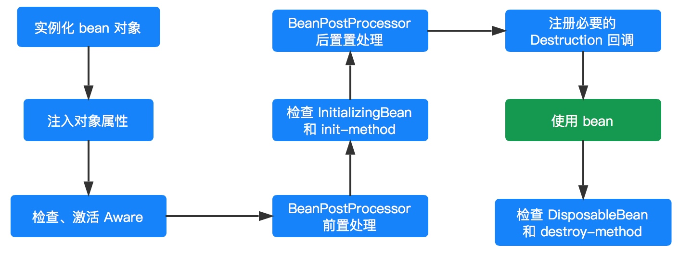

 Spring 并不是一启动容器就开启 bean 的实例化进程，只有当客户端通过显示或者隐式的方式调用`BeanFactory`的 `#getBean(...)` 方法来请求某个实例对象的时候，它才会触发相应 bean 的实例化进程。

当然，也可以选择直接使用`ApplicationContext`容器，因为该容器启动的时候会立刻调用注册到该容器所有 bean 定义的实例化方法。

> 当然，对于`BeanFactory`容器而言，并不是所有的 `#getBean(...)` 方法都会触发实例化进程，比如 singleton 类型的 bean，该类型的 bean 只会在第一次调用 `getBean()` 的时候才会触发，而后续的调用则会直接返回容器缓存中的实例对象。

bean的实例化过程如下图：

## bean实例化

从 [准备创建Bean](05.8.1-Spring源码学习-IOC-加载Bean-准备创建Bean.md)开始，对bean进行实例化。

在实例化过程中，采用策略模式来决定采用哪种方式来实例化bean，一般有反射和CGLIB动态字节码两种方式。

> 详见 [创建Bean的实例](05.8.2-Spring源码学习-IOC-加载Bean-创建Bean-创建Bean的实例.md)中的实例化策略。

## 激活Aware

初始化阶段的第一步。

详见 [初始化Bean](05.8.6-Spring源码学习-IOC-加载Bean-创建Bean-初始化Bean.md) 和 [深入学习Aware接口](06-Spring源码学习-深入学习Aware接口.md)

## BeanPostProcessor

初始化阶段的第二步。

详见 [初始化Bean](05.8.6-Spring源码学习-IOC-加载Bean-创建Bean-初始化Bean.md) 和 [深入学习BeanPostProcessor接口](07-Spring源码学习-深入学习BeanPostProcessor接口.md)

## InitializingBean和init-method

初始化阶段的第三步。

详见 [初始化Bean](05.8.6-Spring源码学习-IOC-加载Bean-创建Bean-初始化Bean.md) 和 [深入学习InitializingBean和init-method](08-Spring源码学习-深入学习InitializingBean和init-method.md)

## DisposableBean和destroy-method

与`InitializingBean`和`init-method`方式类似。

当一个 bean 对象经历了实例化、设置属性、初始化阶段，那么该 bean 对象就可以供容器使用了（调用的过程）。当完成调用后，如果是 singleton 类型的 bean ，则会看当前 bean 是否应实现了`DisposableBean`接口或者配置了 `destroy-method` 属性，如果是的话，则会为该实例注册一个用于对象销毁的回调方法，便于在这些 singleton 类型的 bean 对象销毁之前执行销毁逻辑。

**但是，并不是对象完成调用后就会立刻执行销毁方法，因为这个时候 Spring 容器还处于运行阶段，只有当 Spring 容器关闭的时候才会去调用。**但是， Spring 容器不会这么聪明会自动去调用这些销毁方法，而是需要我们主动去告知 Spring 容器。

- 对于 BeanFactory 容器而言，我们需要主动调用 `#destroySingletons()` 方法，通知 BeanFactory 容器去执行相应的销毁方法。
- 对于 ApplicationContext 容器而言，调用 `#registerShutdownHook()` 方法。

## 总结

1. 根据实例化策略进行实例化。
2. 属性注入。
3. 如果**该bean**实现了`BeanNameAware`接口，调用`setBeanName(beanName)`方法。
4. 如果**该bean**实现了`BeanClassLoaderAware`接口，调用`setBeanClassLoader(classLoader)`方法。
5. 如果**该bean**实现了`BeanFactoryAware`接口，调用`setBeanFactory(beanFactory)`方法。
6. 如果该容器注册了`BeanPostProcessor`接口，调用`postProcessBeforeInitialization(bean, beanName)`方法。
7. 如果**该bean**实现了`InitializingBean`接口，调用`afterPropertiesSet()`方法。
8. 如果**该bean**配置了`init-method`属性，调用指定的初始化方法。
9. 如果**该容器**注册了`BeanPostProcessor`接口，调用`postProcessAfterInitialization(bean, beanName)`方法。
10. 初始化完成，方法调用。
11. 容器关闭前，如果该bean实现了`DisposableBean`接口，则调用 `destroy()` 方法。
12. 容器关闭前，如果该bean配置了`destroy-method`属性，则调用指定的销毁方法。
13. 结束。

> 第3步～第9步为初始化阶段。

## 参考资料

- 芋道源码 精尽 Spring 源码分析