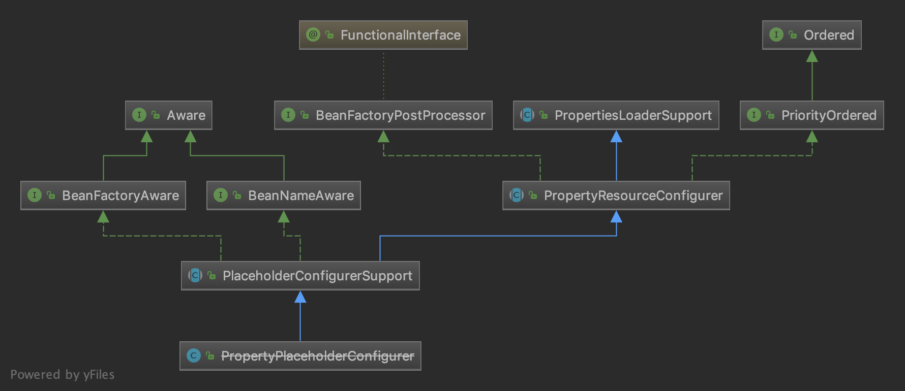

## 作用

`PropertyPlaceholderConfigurer`是`BeanFactoryPostProcessor`的一个实现。

作用：我们在配置文件/注解中使用占位符的方式来定义一些资源，并将这些占位符所代表的资源配置到`properties`中，这样只需要对 Properties 文件进行修改即可。

## 类图



`PropertyPlaceholderConfigurer`简介实现了`BeanFactoryPostProcessor`接口。

`BeanFactoryPostProcessor`接口中的`postProcessBeanFactory(beanFactory)`方法由`PropertyResourceConfigurer`类实现。

## PropertyResourceConfigurer

`PropertyResourceConfigurer`类是属性资源的配置类，它实现了`BeanFactoryPostProcessor`接口中的`postProcessBeanFactory(beanFactory)`方法。

```java
// org.springframework.beans.factory.config.PropertyResourceConfigurer#postProcessBeanFactory
public void postProcessBeanFactory(ConfigurableListableBeanFactory beanFactory) throws BeansException {
  try {
    // 返回合并的 Properties 实例
    Properties mergedProps = mergeProperties();

    // Convert the merged properties, if necessary.
    // 转换合并属性
    convertProperties(mergedProps);

    // Let the subclass process the properties.
    // 模版方法模式，具体的有子类实现
    processProperties(beanFactory, mergedProps);
  }
  catch (IOException ex) {
    throw new BeanInitializationException("Could not load properties", ex);
  }
}
```

步骤：

1. 返回合并的 Properties 实例。Properties 实例维护这一组 `key-value` ，其实就是 Properties 配置文件中的内容。
2. 转换合并属性，就是将原始值替换为真正的值。
3. 前面两个步骤已经将配置文件中的值进行了处理，那么该方法就是真正的替换过程，该方法**由子类实现**。

## PropertyPlaceholderConfigurer

`PropertyPlaceholderConfigurer`实现了`processProperties()`方法：

```java
// org.springframework.beans.factory.config.PropertyPlaceholderConfigurer#processProperties
protected void processProperties(ConfigurableListableBeanFactory beanFactoryToProcess, Properties props)
  throws BeansException {
  // 将传入的Properties对象封装成 StringValueResolver 对象
  StringValueResolver valueResolver = new PlaceholderResolvingStringValueResolver(props);
  // 真正处理
  doProcessProperties(beanFactoryToProcess, valueResolver);
}
```

步骤：

1. 首先构造一个`PlaceholderResolvingStringValueResolver`对象。该类的`resolveStringValue()`方法用于解析String的值。
2. `doProcessProperties()`进行真值的替换操作。

```java
// org.springframework.beans.factory.config.PlaceholderConfigurerSupport#doProcessProperties
protected void doProcessProperties(ConfigurableListableBeanFactory beanFactoryToProcess,
                                   StringValueResolver valueResolver) {
  // 将传入的StringValueResolver对象封装成 BeanDefinitionVisitor 对象
  BeanDefinitionVisitor visitor = new BeanDefinitionVisitor(valueResolver);
  // 该工厂中所有 BeanDefinition 的name
  String[] beanNames = beanFactoryToProcess.getBeanDefinitionNames();
  for (String curName : beanNames) {
    // Check that we're not parsing our own bean definition,
    // to avoid failing on unresolvable placeholders in properties file locations.
    if (!(curName.equals(this.beanName) && beanFactoryToProcess.equals(this.beanFactory))) {
      BeanDefinition bd = beanFactoryToProcess.getBeanDefinition(curName);
      try {
        // 访问
        visitor.visitBeanDefinition(bd);
      }
      catch (Exception ex) {
        throw new BeanDefinitionStoreException(bd.getResourceDescription(), curName, ex.getMessage(), ex);
      }
    }
  }

  // New in Spring 2.5: resolve placeholders in alias target names and aliases as well.
  // 别名的占位符
  beanFactoryToProcess.resolveAliases(valueResolver);

  // New in Spring 3.0: resolve placeholders in embedded values such as annotation attributes.
  // 解析嵌入值的占位符，例如注释属性
  beanFactoryToProcess.addEmbeddedValueResolver(valueResolver);
}
```

`BeanDefinitionVisitor`是`BeanDefinition`的访问者，我们通过它可以实现对`BeanDefinition`内容的进行访问。

核心方法：`visitBeanDefinition()`。该方法访问了`BeanDefinition`中所有值得访问的东西了，包括 parent 、class 、factory-bean 、factory-method 、scope 、property 、constructor-arg 。

它们最后都会调用`resolveStringValue`方法：

```java
// org.springframework.beans.factory.config.BeanDefinitionVisitor#resolveStringValue
protected String resolveStringValue(String strVal) {
  if (this.valueResolver == null) {
    throw new IllegalStateException("No StringValueResolver specified - pass a resolver " +
                                    "object into the constructor or override the 'resolveStringValue' method");
  }
  // 解析真值
  String resolvedValue = this.valueResolver.resolveStringValue(strVal);
  // Return original String if not modified.
  // 如果原始的字符串没有被修改，返回原始值
  return (strVal.equals(resolvedValue) ? strVal : resolvedValue);
}
```

该方法最终委托给了之前封装的`PlaceholderResolvingStringValueResolver`来处理：

```java
// org.springframework.beans.factory.config.PropertyPlaceholderConfigurer.PlaceholderResolvingStringValueResolver#resolveStringValue
public String resolveStringValue(String strVal) throws BeansException {
  // 解析真值
  String resolved = this.helper.replacePlaceholders(strVal, this.resolver);
  if (trimValues) {
    resolved = resolved.trim();
  }
  return (resolved.equals(nullValue) ? null : resolved);
}	
```

解析真值的过程就是替换字符串的`${}`中的内容。

## 应用场景

- 动态加载配置文件，多环境切换。
- 属性加解密。

### 应用-动态加载配置文件

> 示例在`spring-context`的`test`中。

`application.properties`：

```properties
student.name=enhao
```

`property_placeholder_configurer_test.xml`配置文件：

```xml
<bean id="propertyPlaceholderConfigurer" class="org.springframework.beans.factory.config.PropertyPlaceholderConfigurer">
  <property name="locations">
    <list>
      <value>classpath:config/application.properties</value>
    </list>
  </property>
</bean>

<bean id="studentService" class="learning.property_placeholder_configurer.StudentService">
  <property name="name" value="${student.name}"/>
</bean>
```

测试：

```java
ApplicationContext context = new ClassPathXmlApplicationContext("spring.xml");

StudentService studentService = (StudentService) context.getBean("studentService");
System.out.println("student name:" + studentService.getName());
```

结果：`${student.name}`被替换为了`enhao`。


## 参考资料

- 芋道源码 精尽 Spring 源码分析