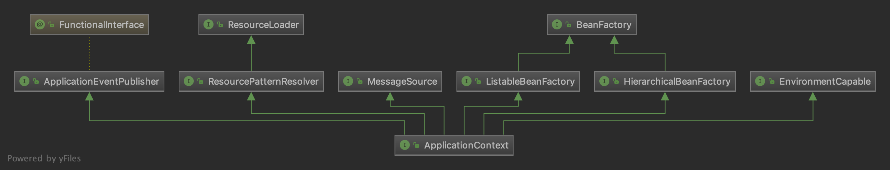
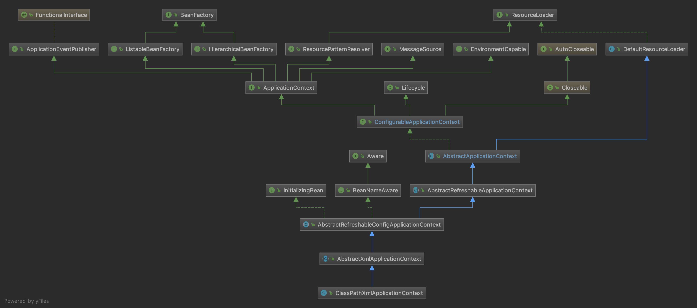

## ApplicationContext接口



- `BeanFactory`：Bean 容器的顶层接口。
  - `HierarchicalBeanFactory`：有层级关系的`BeanFactory`。拥有`parentBeanFactory`属性。
  - `ListableBeanFactory`：可以列举出当前`BeanFactory`中所有的 Bean 对象。

- `ApplicationEventPublisher`：封装时间发布功能的接口，向事件监听器（Listener）发送事件消息。

- `ResourceLoader`：加载资源顶层接口。

  - `ResourcePatternResolver`：用来将`location`解析为`Resource`对象的策略接口。

    > 详见 [资源定位](03-Spring源码学习-IOC-资源定位.md)

- `MessageSource`：解析`message`的策略接口，提供国际化的标准访问策略。

- `EnvironmentCapable`：获取`Environment`接口。

## ApplicationContext子接口

### WebApplicationContext

```java
public interface WebApplicationContext extends ApplicationContext {

   String ROOT_WEB_APPLICATION_CONTEXT_ATTRIBUTE = WebApplicationContext.class.getName() + ".ROOT";

   String SCOPE_REQUEST = "request";

   String SCOPE_SESSION = "session";

   String SCOPE_APPLICATION = "application";

   String SERVLET_CONTEXT_BEAN_NAME = "servletContext";

   String CONTEXT_PARAMETERS_BEAN_NAME = "contextParameters";

   String CONTEXT_ATTRIBUTES_BEAN_NAME = "contextAttributes";

   @Nullable
   ServletContext getServletContext();
}
```

该接口只有一个方法`getServletContext()`，用来获取`Servlet`上下文信息。

### ConfigurableApplicationContext

```java
public interface ConfigurableApplicationContext extends ApplicationContext, Lifecycle, Closeable {
	/**
	 * 为 ApplicationContext 设置唯一id
	 */
	void setId(String id);

	/**
	 * 为 ApplicationContext 设置 parent
	 */
	void setParent(@Nullable ApplicationContext parent);

	/**
	 * 为 ApplicationContext 设置 Environment
	 */
	void setEnvironment(ConfigurableEnvironment environment);

	/**
	 * 获取 Environment
	 */
	@Override
	ConfigurableEnvironment getEnvironment();

	/**
	 * 为 ApplicationContext 添加 BeanFactoryPostProcessor
	 */
	void addBeanFactoryPostProcessor(BeanFactoryPostProcessor postProcessor);

	/**
	 * 为 ApplicationContext 添加 ApplicationListener
	 */
	void addApplicationListener(ApplicationListener<?> listener);

	/**
	 * 为 ApplicationContext 添加 ProtocolResolver
	 */
	void addProtocolResolver(ProtocolResolver resolver);

	/**
	 * 加载/刷新配置
	 */
	void refresh() throws BeansException, IllegalStateException;

	/**
	 * 注册 shutdown 钩子
	 */
	void registerShutdownHook();

	/**
	 * 关闭 ApplicationContext
	 */
	@Override
	void close();

	/**
	 * ApplicationContext 是否处于激活状态
	 */
	boolean isActive();

	/**
	 * 获取当前上下文的 BeanFactory
	 */
	ConfigurableListableBeanFactory getBeanFactory() throws IllegalStateException;

}
```

`ConfigurableApplicationContext`正如它的名字一样，它的方法都是对`ApplicationContext`进行配置的。一般包含`setXxx()`和`addXxx()`方法。

它还继承了另外两个接口：

- `Lifecycle`：对`Context`的生命周期的管理。提供`start()`和`stop()`方法。
- `Closeable`：用于关闭资源。

### ConfigurableWebApplicationContext

`ConfigurableWebApplicationContext`继承了上面提到的两个接口：`WebApplicationContext`和`ConfigurableApplicationContext`，是一个**可配置、可管理、可关闭的`WebApplicationContext`。**

```java
public interface ConfigurableWebApplicationContext extends WebApplicationContext, ConfigurableApplicationContext {

	/**
	 * 为 ApplicationContext 添加 Servlet 上下文
	 */
	void setServletContext(@Nullable ServletContext servletContext);

	/**
	 * 为 ApplicationContext 添加 Servlet 配置
	 */
	void setServletConfig(@Nullable ServletConfig servletConfig);

	/**
	 * 获取 Servlet 配置
	 */
	@Nullable
	ServletConfig getServletConfig();

	/**
	 * 为 ApplicationContext 添加命名控件
	 */
	void setNamespace(@Nullable String namespace);

	/**
	 * 获取命名空间
	 */
	@Nullable
	String getNamespace();

	/**
	 * 为 ApplicationContext 添加配置路径 
	 */
	void setConfigLocation(String configLocation);

	/**
	 * 为 ApplicationContext 添加多个配置路径 
	 */
	void setConfigLocations(String... configLocations);

	/**
	 * 获取配置路径
	 */
	@Nullable
	String[] getConfigLocations();

}
```

正如其名称一样，可配置的，所以又添加了一些可配置项。包括`ServletContext`、`ServletConfig`、`namespace`、`configLocation`。

### ClassPathXmlApplicationContext




#### MessageSource

解析`message`的策略接口，提供国际化的标准访问策略。

策略方法：`getMessage(...)`。在`ApplicationContext`体系中，该方法由`AbstractApplicationContext`实现。

```java
public abstract class AbstractApplicationContext extends DefaultResourceLoader
		implements ConfigurableApplicationContext {
		@Nullable
		private MessageSource messageSource;
    
    protected void initMessageSource() {
			ConfigurableListableBeanFactory beanFactory = getBeanFactory();
			if (beanFactory.containsLocalBean(MESSAGE_SOURCE_BEAN_NAME)) {
				this.messageSource = beanFactory.getBean(MESSAGE_SOURCE_BEAN_NAME, MessageSource.class);
				// Make MessageSource aware of parent MessageSource.
				if (this.parent != null && this.messageSource instanceof HierarchicalMessageSource) {
					HierarchicalMessageSource hms = (HierarchicalMessageSource) this.messageSource;
					if (hms.getParentMessageSource() == null) {
						// Only set parent context as parent MessageSource if no parent MessageSource
						// registered already.
						hms.setParentMessageSource(getInternalParentMessageSource());
					}
				}
				if (logger.isTraceEnabled()) {
					logger.trace("Using MessageSource [" + this.messageSource + "]");
				}
			}
			else {
				// Use empty MessageSource to be able to accept getMessage calls.
				DelegatingMessageSource dms = new DelegatingMessageSource();
				dms.setParentMessageSource(getInternalParentMessageSource());
				this.messageSource = dms;
				beanFactory.registerSingleton(MESSAGE_SOURCE_BEAN_NAME, this.messageSource);
				if (logger.isTraceEnabled()) {
					logger.trace("No '" + MESSAGE_SOURCE_BEAN_NAME + "' bean, using [" + this.messageSource + "]");
				}
			}
		}
	
}
```

`AbstractApplicationContext`中持有了一个`MessageSource`实例，该实例来源于`initMessageSource()`方法：

- 如果容器中有名称为`messageSource`的bean，则从容器中取。
- 如果容器中没有，则使用`DelegatingMessageSource`，即使用空`MessageSource`可以接受`getMessage`调用。

`getMessage(...)`方法，委托给了实际的`MessageSource`完成。即策略模式：

```java
// org.springframework.context.support.AbstractApplicationContext#getMessageSource
private MessageSource getMessageSource() throws IllegalStateException {
  if (this.messageSource == null) {
    throw new IllegalStateException("MessageSource not initialized - " +
                                    "call 'refresh' before accessing messages via the context: " + this);
  }
  return this.messageSource;
}

@Override
public String getMessage(String code, @Nullable Object[] args, @Nullable String defaultMessage, Locale locale) {
  return getMessageSource().getMessage(code, args, defaultMessage, locale);
}

@Override
public String getMessage(String code, @Nullable Object[] args, Locale locale) throws NoSuchMessageException {
  return getMessageSource().getMessage(code, args, locale);
}

@Override
public String getMessage(MessageSourceResolvable resolvable, Locale locale) throws NoSuchMessageException {
  return getMessageSource().getMessage(resolvable, locale);
}
```


#### ApplicationEventPublisher

用于封装事件发布功能的接口，向事件监听器（Listener）发送事件消息。

该接口提供了`publishEvent(…)`方法。该方法由`AbstractApplicationContext`实现。

```java
// org.springframework.context.support.AbstractApplicationContext#publishEvent(org.springframework.context.ApplicationEvent)
@Override
public void publishEvent(ApplicationEvent event) {
  publishEvent(event, null);
}

@Override
public void publishEvent(Object event) {
  publishEvent(event, null);
}

protected void publishEvent(Object event, @Nullable ResolvableType eventType) {
  Assert.notNull(event, "Event must not be null");

  // Decorate event as an ApplicationEvent if necessary
  ApplicationEvent applicationEvent;
  if (event instanceof ApplicationEvent) {
    applicationEvent = (ApplicationEvent) event;
  }
  else {
    // event 不是 ApplicationEvent，包装成 PayloadApplicationEvent
    applicationEvent = new PayloadApplicationEvent<>(this, event);
    if (eventType == null) {
      eventType = ((PayloadApplicationEvent<?>) applicationEvent).getResolvableType();
    }
  }

  // Multicast right now if possible - or lazily once the multicaster is initialized
  if (this.earlyApplicationEvents != null) {
    this.earlyApplicationEvents.add(applicationEvent);
  }
  else {
    getApplicationEventMulticaster().multicastEvent(applicationEvent, eventType);
  }

  // Publish event via parent context as well...
  // 存在 parent ApplicationContext，并且 parent 也是 AbstractApplicationContext 同样要将 event 发布给父级 ApplicationContext 。
  if (this.parent != null) {
    if (this.parent instanceof AbstractApplicationContext) {
      ((AbstractApplicationContext) this.parent).publishEvent(event, eventType);
    }
    else {
      this.parent.publishEvent(event);
    }
  }
}
```

1. `event` 不是 `ApplicationEvent`，包装成 `PayloadApplicationEvent`。
2. 存在 parent `ApplicationContext`，并且 parent 也是 `AbstractApplicationContext` 同样要将 `event` 发布给父级 `ApplicationContext` 。

#### ResourcePatternResolver

> 详见 [资源定位](03-Spring源码学习-IOC-资源定位.md)

`ResourcePatternResolver`接口将`location`解析为`Resource`对象的策略接口。

`getResources(locationPatter)`方法由`AbstractApplicationContext`接口实现：

```java
private ResourcePatternResolver resourcePatternResolver;

protected ResourcePatternResolver getResourcePatternResolver() {
		return new PathMatchingResourcePatternResolver(this);
	}

@Override
public Resource[] getResources(String locationPattern) throws IOException {
  return this.resourcePatternResolver.getResources(locationPattern);
}
```

可以发现，`getResources(locationPatter)`方法委托给了`ResourcePatternResolver`实现。

而使用的默认`ResourcePatternResolver`实现是`PathMatchingResourcePatternResolver`。

#### EnvironmentCapable

提供当前系统环境 Environment 组件。

`getEnvironment()`方法由`AbstractApplicationContext`实现。

```java
@Nullable
private ConfigurableEnvironment environment;

@Override
public ConfigurableEnvironment getEnvironment() {
  if (this.environment == null) {
    this.environment = createEnvironment();
  }
  return this.environment;
}

protected ConfigurableEnvironment createEnvironment() {
  return new StandardEnvironment();
}
```

> StandardEnvironment 是一个适用于非 WEB 应用的 Environment。

#### Lifecycle

`Lifecycle`用于管理生命周期的接口。

`start()`、`stop()`、`isRunning()`方法由`AbstractApplicationContext`实现。

```java
private LifecycleProcessor lifecycleProcessor;

LifecycleProcessor getLifecycleProcessor() throws IllegalStateException {
  if (this.lifecycleProcessor == null) {
    throw new IllegalStateException("LifecycleProcessor not initialized - " +
                                    "call 'refresh' before invoking lifecycle methods via the context: " + this);
  }
  return this.lifecycleProcessor;
}

@Override
public void start() {
  getLifecycleProcessor().start();
  publishEvent(new ContextStartedEvent(this));
}

@Override
public void stop() {
  getLifecycleProcessor().stop();
  publishEvent(new ContextStoppedEvent(this));
}

@Override
public boolean isRunning() {
  return (this.lifecycleProcessor != null && this.lifecycleProcessor.isRunning());
}
```

可以看出`Lifecycle`接口的实现委托给了`LifecycleProcessor`。

> 在启动、停止的时候会分别发布 ContextStartedEvent 和 ContextStoppedEvent 事件。

`LifecycleProcessor`的具体实现和`MessageSource`类似：

```java
protected void initLifecycleProcessor() {
  ConfigurableListableBeanFactory beanFactory = getBeanFactory();
  if (beanFactory.containsLocalBean(LIFECYCLE_PROCESSOR_BEAN_NAME)) {
    this.lifecycleProcessor =
      beanFactory.getBean(LIFECYCLE_PROCESSOR_BEAN_NAME, LifecycleProcessor.class);
    if (logger.isTraceEnabled()) {
      logger.trace("Using LifecycleProcessor [" + this.lifecycleProcessor + "]");
    }
  }
  else {
    DefaultLifecycleProcessor defaultProcessor = new DefaultLifecycleProcessor();
    defaultProcessor.setBeanFactory(beanFactory);
    this.lifecycleProcessor = defaultProcessor;
    beanFactory.registerSingleton(LIFECYCLE_PROCESSOR_BEAN_NAME, this.lifecycleProcessor);
    if (logger.isTraceEnabled()) {
      logger.trace("No '" + LIFECYCLE_PROCESSOR_BEAN_NAME + "' bean, using " +
                   "[" + this.lifecycleProcessor.getClass().getSimpleName() + "]");
    }
  }
}
```

1. 如果容器中存在名称为`lifecycleProcessor`的bean，则使用容器里的bean。
2. 如果容器中没有，则使用`DefaultLifecycleProcessor`

#### Closeable

`Closable`接口用于关闭和释放资源。

 `close()` 方法，由`AbstractApplicationContext`实现，用于关闭`ApplicationContext`销毁所有 Bean ，此外如果注册有 JVM shutdown hook ，同样要将其移除。

```java
public void close() {
  synchronized (this.startupShutdownMonitor) {
    doClose();
    // If we registered a JVM shutdown hook, we don't need it anymore now:
    // We've already explicitly closed the context.
    if (this.shutdownHook != null) {
      try {
        Runtime.getRuntime().removeShutdownHook(this.shutdownHook);
      }
      catch (IllegalStateException ex) {
        // ignore - VM is already shutting down
      }
    }
  }
}
protected void doClose() {
  // Check whether an actual close attempt is necessary...
  if (this.active.get() && this.closed.compareAndSet(false, true)) {
    if (logger.isDebugEnabled()) {
      logger.debug("Closing " + this);
    }

    LiveBeansView.unregisterApplicationContext(this);

    try {
      // Publish shutdown event.
      // 发布关闭事件
      publishEvent(new ContextClosedEvent(this));
    }
    catch (Throwable ex) {
      logger.warn("Exception thrown from ApplicationListener handling ContextClosedEvent", ex);
    }

    // Stop all Lifecycle beans, to avoid delays during individual destruction.
    // 停止所有生命周期bean，以避免在个别销毁期间出现延迟。
    if (this.lifecycleProcessor != null) {
      try {
        this.lifecycleProcessor.onClose();
      }
      catch (Throwable ex) {
        logger.warn("Exception thrown from LifecycleProcessor on context close", ex);
      }
    }

    // Destroy all cached singletons in the context's BeanFactory.
    // 在上下文的BeanFactory中销毁所有缓存的单例。
    destroyBeans();

    // Close the state of this context itself.
    // 关闭此上下文本身的状态。
    closeBeanFactory();

    // Let subclasses do some final clean-up if they wish...
    onClose();

    // Reset local application listeners to pre-refresh state.
    // 将本地应用程序侦听器重置为预刷新状态。
    if (this.earlyApplicationListeners != null) {
      this.applicationListeners.clear();
      this.applicationListeners.addAll(this.earlyApplicationListeners);
    }

    // Switch to inactive.
    // 切换到非活动状态
    this.active.set(false);
  }
}
```

#### InitializingBean

> 关于`InitializingBean`：详见 [深入学习InitializingBean和init-method](08-Spring源码学习-深入学习InitializingBean和init-method.md) 

`InitializingBean`为bean提供初始化方法`afterPropertiesSet`。

在 `ApplicationContext`体系中，该方法由 `AbstractRefreshableConfigApplicationContext` 实现

```java
@Override
public void afterPropertiesSet() {
  if (!isActive()) {
    refresh();
  }
}
```

当容器处于激活状态时，调用`refresh()`方法，执行整个 Spring 容器的初始化过程。

> 详见：[ApplicationContext的refresh()方法](12-Spring源码学习-容器功能扩展-ApplicationContext的refresh()方法.md)

#### BeanNameAware

> 关于`Aware`接口：详见 [深入学习Aware接口](06-Spring源码学习-深入学习Aware接口.md)

设置 Bean Name 的接口，`setBeanName()`方法由`AbstractRefreshableConfigApplicationContext`实现。

```java
public void setBeanName(String name) {
  if (!this.setIdCalled) {
    super.setId(name);
    setDisplayName("ApplicationContext '" + name + "'");
  }
}
```


## 参考资料

- 芋道源码 精尽 Spring 源码分析