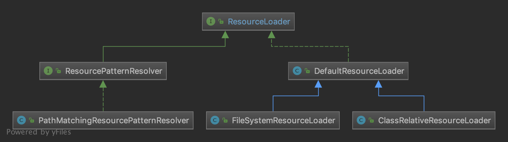

## 工厂方法

【资源定位`Resource`和`ResourceLoader`】：



由不同的`ResourceLoader`加载不同的`Resource`对象。

【通过指定的工厂创建bean】：

在Spring中，我们可以通过指定的工厂方法创建bean。

```xml
<bean name="testBean" class="com.test.TestBeanFactory" factory-method="createBean" ></bean>
```

通过`factory-method`指定工厂类中创建bean的方法。

【`FactoryBean`】：

Spring中有一种bean是`FactoryBean`，在获取bean时，如果该bean是`FactoryBean`的实现类，则会调用`FactoryBean#getObject()`方法获取实际的bean对象。

## 单例模式

【Spring中的Bean 模式都是单例模式】


【Spring中缓存使用了双重锁检测实现的单例】：

- `handlerMappings`：加载 `META-INF/spring.handlers` 里的内容。


## 建造者模式

【`BeanDefinitionBuilder`】：

在解析自定义标签中`org.springframework.beans.factory.xml.AbstractSingleBeanDefinitionParser#parseInternal`中，构建了一个`BeanDefinitionBuilder`。


## 模板方法

【解析`BeanDefinition`】：

```java
// org.springframework.beans.factory.xml.DefaultBeanDefinitionDocumentReader#doRegisterBeanDefinitions
protected void doRegisterBeanDefinitions(Element root) {
    // Any nested <beans> elements will cause recursion in this method. In
    // order to propagate and preserve <beans> default-* attributes correctly,
    // keep track of the current (parent) delegate, which may be null. Create
    // the new (child) delegate with a reference to the parent for fallback purposes,
    // then ultimately reset this.delegate back to its original (parent) reference.
    // this behavior emulates a stack of delegates without actually necessitating one.
    // 记录老的 BeanDefinitionParserDelegate 对象
    BeanDefinitionParserDelegate parent = this.delegate;
    // 创建 BeanDefinitionParserDelegate 对象，并进行设置到 delegate
    this.delegate = createDelegate(getReaderContext(), root, parent);
    // 检测 <beans /> 根标签的命名空间是否是默认的命名空间
    // 默认命名空间：命名空间为空或者是http://www.springframework.org/schema/beans
    if (this.delegate.isDefaultNamespace(root)) {
        // 处理 profile 属性
        String profileSpec = root.getAttribute(PROFILE_ATTRIBUTE);
        if (StringUtils.hasText(profileSpec)) {
            // 使用分隔符切分，可能有多个 profile 。
            String[] specifiedProfiles = StringUtils.tokenizeToStringArray(
                profileSpec, BeanDefinitionParserDelegate.MULTI_VALUE_ATTRIBUTE_DELIMITERS);
            // We cannot use Profiles.of(...) since profile expressions are not supported
            // in XML config. See SPR-12458 for details.
            // 如果所有 profile 都无效，则不进行注册
            if (!getReaderContext().getEnvironment().acceptsProfiles(specifiedProfiles)) {
                if (logger.isDebugEnabled()) {
                    logger.debug("Skipped XML bean definition file due to specified profiles [" + profileSpec +
                                 "] not matching: " + getReaderContext().getResource());
                }
                return;
            }
        }
    }
    // 解析前处理，空实现，由子类实现
    preProcessXml(root);
    // 解析
    parseBeanDefinitions(root, this.delegate);
    // 解析后处理，空实现，由子类实现
    postProcessXml(root);

    // 设置 delegate 回老的 BeanDefinitionParserDelegate 对象
    this.delegate = parent;
}
```

在解析`BeanDefinition`的前后，有两个方法，`preProcessXml()`和`postProcessXml()`，这两个方法默认都是空实现，有子类实现。典型的模板方法设计模式。


【解析自定义标签】：

```java
// org.springframework.beans.factory.xml.AbstractSingleBeanDefinitionParser#parseInternal
protected final AbstractBeanDefinition parseInternal(Element element, ParserContext parserContext) {
  // 构建 BeanDefinitionBuilder 对象
  BeanDefinitionBuilder builder = BeanDefinitionBuilder.genericBeanDefinition();
  // 获取父类元素
  String parentName = getParentName(element);
  if (parentName != null) {
    builder.getRawBeanDefinition().setParentName(parentName);
  }
  // 获取自定义标签中的 class，这个时候会去调用自定义解析中的 getBeanClass()
  Class<?> beanClass = getBeanClass(element);
  if (beanClass != null) {
    builder.getRawBeanDefinition().setBeanClass(beanClass);
  }
  else {
    // beanClass 为 null，意味着子类并没有重写 getBeanClass() 方法，则尝试去判断是否重写了 getBeanClassName()
    String beanClassName = getBeanClassName(element);
    if (beanClassName != null) {
      builder.getRawBeanDefinition().setBeanClassName(beanClassName);
    }
  }
  // 设置 source 属性
  builder.getRawBeanDefinition().setSource(parserContext.extractSource(element));
  // 设置 scope 属性
  BeanDefinition containingBd = parserContext.getContainingBeanDefinition();
  if (containingBd != null) {
    // Inner bean definition must receive same scope as containing bean.
    builder.setScope(containingBd.getScope());
  }
  // 设置 lazy-init 属性
  if (parserContext.isDefaultLazyInit()) {
    // Default-lazy-init applies to custom bean definitions as well.
    builder.setLazyInit(true);
  }
  // 调用子类的 doParse() 进行解析
  doParse(element, parserContext, builder);
  // 生成 GenericBeanDefinition 对象
  return builder.getBeanDefinition();
}
```

解析自定义标签的核心方法中，`#getBeanClass((Element element)` 、`#doParse(Element element, BeanDefinitionBuilder builder)`方法默认都是空实现，都需要子类去实现。


【`ApplicationContext`的`refresh()`】：

TODO


【`JdbcTemplate`】：

模板方法设计模式的变种：回调机制。

TODO


## 原型模式

Spring的bean的scope=prototype


## 策略模式

【bean实例化策略】：

详见 [创建Bean的实例](05.8.2-Spring源码学习-IOC-加载Bean-创建Bean-创建Bean的实例.md) 中的实例化策略。

【`MessageSource`】：

详见 [ApplicationContext相关接口](11-Spring源码学习-容器功能扩展-ApplicationContext相关接口.md) 中的`MessageSource`。

## 代理模式

TODO


## 门面模式

【`ApplicationContext`】：

`ApplicationContext`整合了`BeanFactory`、`ApplicationEventPublisher`、`ResourceLoader`、`MessageSource`等，提供了统一的入口，即门面模式。